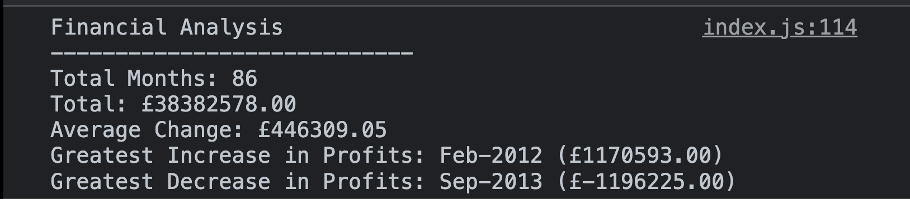

# Console-Finances

## Description

The primary goal of this project was to grasp fundamental JavaScript features, like mathematical operations, however it was kept tidy and neat by using loops and statements to prevent code repetition.
Using fundamental mathematical operations on an array of values and dates, this project was designed to answer common financial queries.
It does help to streamline the project using a single loop and an IF/ELSE sequence to reduce the requirement for human labour or even many lines of code.
I did discover how important "For" loops can be during the process, as well as how to set up the variables inside of one so that the information is contained properly. 

## Table of Contents 

- [Installation](#installation)
- [Usage](#usage)
- [Credits](#credits)
- [License](#license)

## Installation

Although there is no need for installation, the user must open the CONSOLE in their preferred IDE or browser in order to view the project.

## Usage
Application output using Chrome's console. 
    

## Credits

- [Guilherme Deretti](https://github.com/GuilhermeDeretti)
- [Sam Brooke](https://github.com/Sam010000101)
- [Vittoria Bugana](https://github.com/vbugana)

## License

Copyright <2022> <Victor Biscio>

Permission is hereby granted, free of charge, to any person obtaining a copy of this software and associated documentation files (the "Software"), to deal in the Software without restriction, including without limitation the rights to use, copy, modify, merge, publish, distribute, sublicense, and/or sell copies of the Software, and to permit persons to whom the Software is furnished to do so, subject to the following conditions:

The above copyright notice and this permission notice shall be included in all copies or substantial portions of the Software.

THE SOFTWARE IS PROVIDED "AS IS", WITHOUT WARRANTY OF ANY KIND, EXPRESS OR IMPLIED, INCLUDING BUT NOT LIMITED TO THE WARRANTIES OF MERCHANTABILITY, FITNESS FOR A PARTICULAR PURPOSE AND NONINFRINGEMENT. IN NO EVENT SHALL THE AUTHORS OR COPYRIGHT HOLDERS BE LIABLE FOR ANY CLAIM, DAMAGES OR OTHER LIABILITY, WHETHER IN AN ACTION OF CONTRACT, TORT OR OTHERWISE, ARISING FROM, OUT OF OR IN CONNECTION WITH THE SOFTWARE OR THE USE OR OTHER DEALINGS IN THE SOFTWARE.

## Badges

## Tests

Please note: In order to visualise the app the user has to open the IDE/browser console.
[Deployed Application](https://reinkaoss.github.io/Console-Finances/)
